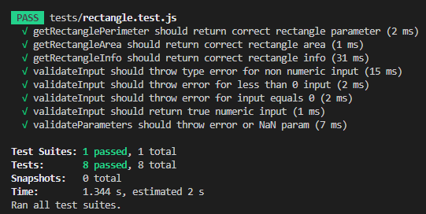

# qa-bootcamp-hometask

## Resolving dependencies
Install dependencies by running command 
`yarn install`

## Running tests
In order to run the test suite, type command
`yarn test`

The following should appear
